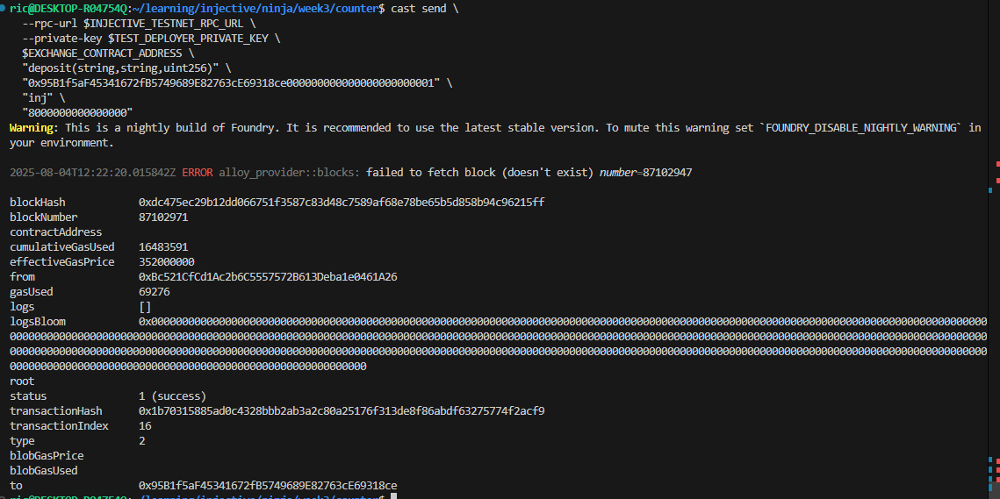
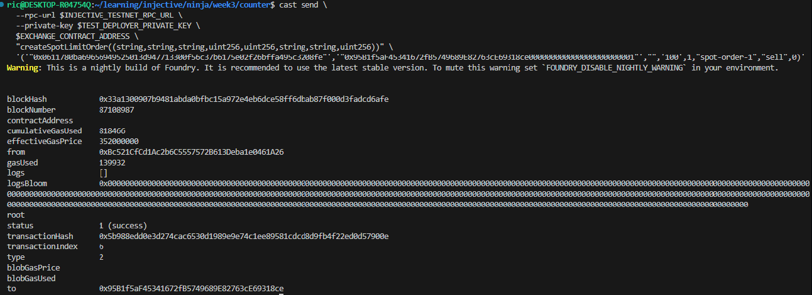
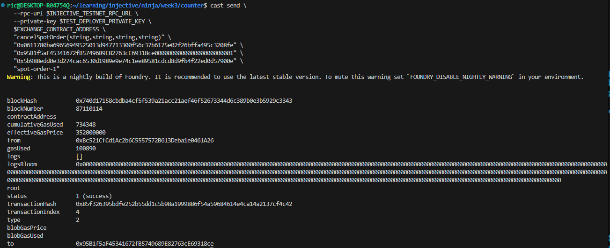

# Dex project

This is a dex project interating with Injective Precompiled Exchange contract, written using Foundry.

Deployed contract address (injective-testnet) : [0x95B1f5aF45341672fB5749689E82763cE69318ce](https://testnet.blockscout.injective.network/address/0x95B1f5aF45341672fB5749689E82763cE69318ce?tab=contract)

### Deposit

### Create Spot Limit Order

### Cancel Spot Limit Order
